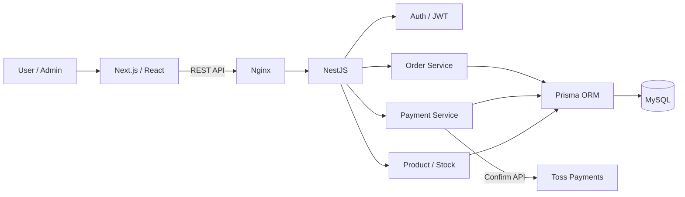
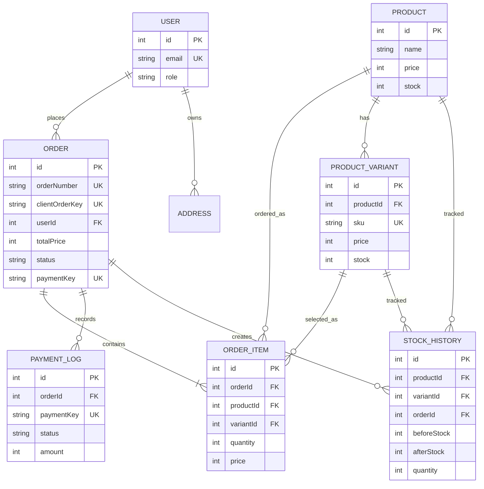
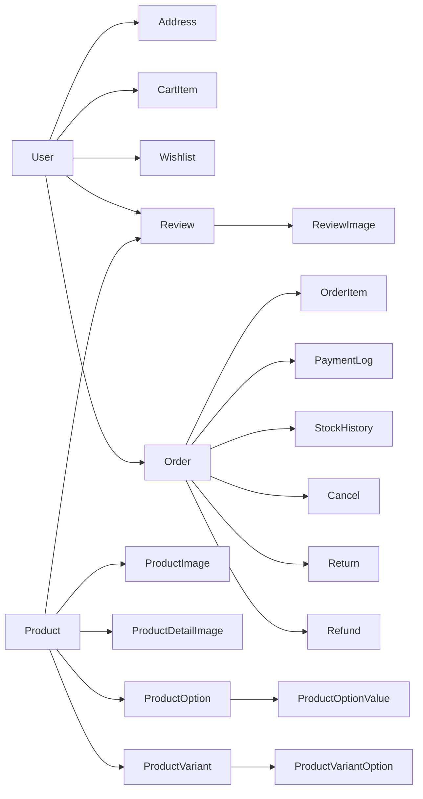
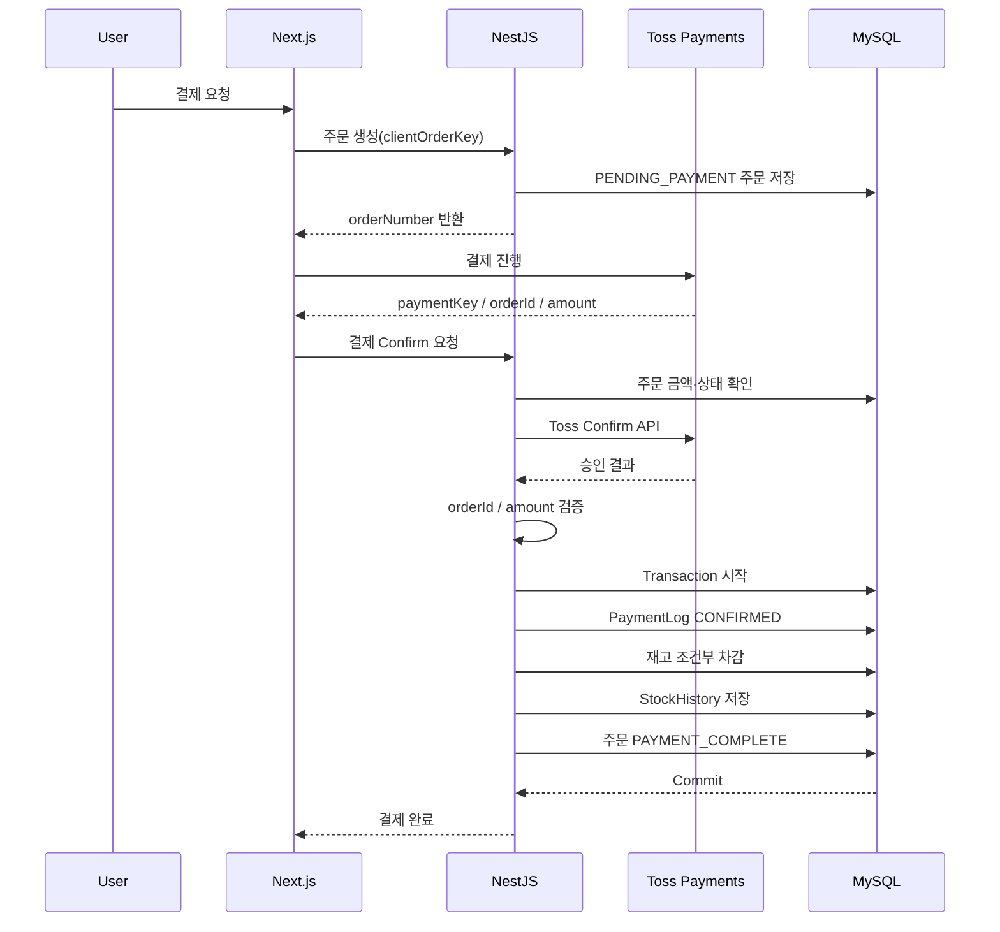
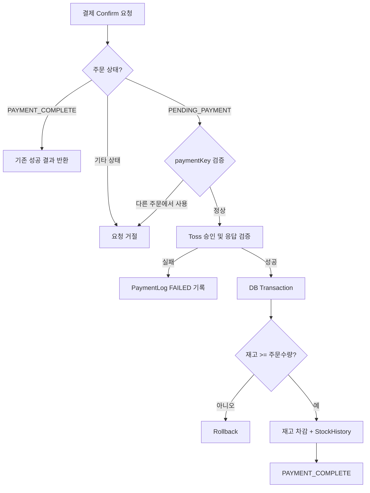

# SEWON MALL

> 주문·결제·재고 정합성을 중심으로 구현한 E-Commerce Web Application

SEWON MALL은 상품 조회부터 장바구니, 주문, 결제, 재고 관리, 리뷰, 관리자 기능까지 구현한 쇼핑몰 프로젝트입니다. 단순 CRUD 구현을 넘어 **중복 주문 방지, 결제 성공 이후 재고 차감, 결제 로그 및 재고 이력 관리, 트랜잭션 처리** 등 실제 쇼핑몰 백엔드에서 발생할 수 있는 데이터 정합성 문제를 해결하는 데 초점을 맞췄습니다.

---

## 1. Tech Stack

### Frontend
- Next.js
- React
- TypeScript
- Tailwind CSS
- Axios
- Toss Payments SDK

### Backend
- NestJS
- TypeScript
- Prisma ORM
- JWT / Passport
- Swagger

### Database
- MySQL

### Test / Infra
- K6
- Oracle Cloud VPS
- Nginx

---

## 2. System Architecture



외부 결제 API 통신과 DB 변경 책임을 분리하고, 결제 승인 검증 이후 필요한 DB 작업만 트랜잭션으로 처리했습니다.

---

## 3. 주요 기능

### 사용자
- 회원가입 / 로그인
- JWT 기반 인증
- 배송지 관리
- 상품 조회 및 상세 조회
- 상품 옵션(Variant) 선택
- 장바구니
- 찜 목록
- 주문 생성 및 주문 내역 조회
- Toss Payments 결제
- 리뷰 작성 및 이미지 등록

### 관리자
- 상품 관리
- 주문 관리
- 재고 현황 조회
- 주문 상태 변경
- 재고 변동 이력 관리

---

## 4. Backend 핵심 구현

### 4-1. 중복 주문 방지

결제 페이지 새로고침이나 중복 요청으로 동일 주문이 여러 번 생성되는 상황을 고려했습니다.

`Order.clientOrderKey`에 Unique 제약을 적용하여 클라이언트의 동일 주문 요청을 식별하고 중복 생성을 방지했습니다.

```text
Client Order Request
       ↓
clientOrderKey 확인
       ↓
기존 주문 존재 → 기존 주문 반환
       ↓
기존 주문 없음 → 신규 주문 생성
```

### 4-2. 결제와 재고 데이터 정합성

초기 구조에서는 주문 생성 단계에서 재고를 차감하면 결제 실패 시 실제 판매가 이루어지지 않았는데도 재고가 감소할 수 있었습니다.

이를 개선하여 **외부 결제가 정상 승인된 이후에만 재고가 차감**되도록 결제 흐름을 구성했습니다.

상품과 Variant 재고 모두 `stock >= quantity` 조건을 만족할 때만 차감하도록 처리하여 재고 부족 상황도 함께 방어했습니다.

### 4-3. 결제 중복 처리 방지

`paymentKey`를 Unique 값으로 관리하고 이미 결제 완료된 주문이나 처리된 결제 요청이 다시 들어오는 경우 중복 처리되지 않도록 검증 로직을 구현했습니다.

### 4-4. 결제 로그 및 재고 이력 관리

결제 요청/응답과 실패 정보를 `PaymentLog`에 기록하고, 재고 변경 전후 값을 `StockHistory`에 저장해 주문과 재고 변화를 추적할 수 있도록 구성했습니다.

---

## 5. Database Design

### 면접용 핵심 ERD



핵심은 `Order`를 중심으로 `PaymentLog`와 `StockHistory`를 분리해 현재 상태뿐 아니라 **결제 과정과 재고 변경 원인까지 추적 가능하도록 설계**한 점입니다.

### 확장 도메인 구조



---

## 6. 주문·결제·재고 Flow

### 결제 성공 흐름



### 실패·중복 요청 방어



---

## 7. Performance Test

K6를 이용해 주문 API에 대한 부하 테스트를 진행했습니다.

| 항목 | 결과 |
|---|---:|
| 요청 수 | 6,000 requests |
| 실패율 | 0% |
| 평균 응답 시간 | 약 18.9ms |

단순 기능 구현에서 끝내지 않고 다수의 요청 상황에서도 주문 API가 정상적으로 처리되는지 검증했습니다.

---

## 8. Project Structure

```text
sewon-mall
├─ frontend
│  ├─ app
│  └─ src
│
├─ backend
│  ├─ prisma
│  │  └─ schema.prisma
│  ├─ src
│  │  ├─ auth
│  │  ├─ order
│  │  ├─ payments
│  │  ├─ product
│  │  └─ admin
│  └─ k6
│
└─ README.md
```

---

## 9. 주요 Trouble Shooting

| 문제 | 개선 방향 |
|---|---|
| 결제 실패 후 재고 불일치 | 결제 승인 성공 이후 재고 차감 |
| 중복 주문 요청 | `clientOrderKey` Unique 기반 중복 방지 |
| 결제 중복 승인 | `paymentKey` 검증 및 주문 상태 확인 |
| 재고 추적 어려움 | `StockHistory`로 변경 전후 재고 기록 |
| 결제 오류 추적 어려움 | `PaymentLog`에 요청·응답·실패 정보 기록 |

상세한 문제 해결 과정은 Notion 포트폴리오에서 정리했습니다.

---

## 10. What I Learned

이 프로젝트를 통해 쇼핑몰 백엔드에서는 기능 구현 자체보다 **주문·결제·재고 사이의 데이터 정합성을 유지하는 것**이 중요하다는 점을 경험했습니다.

특히 외부 결제 API와 DB 작업을 분리하고 필요한 DB 변경 구간을 트랜잭션으로 처리하면서, 실패 상황과 중복 요청을 고려한 서버 로직을 설계하는 경험을 쌓았습니다.
